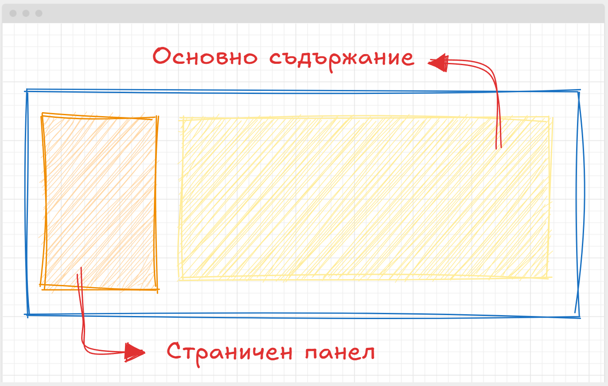
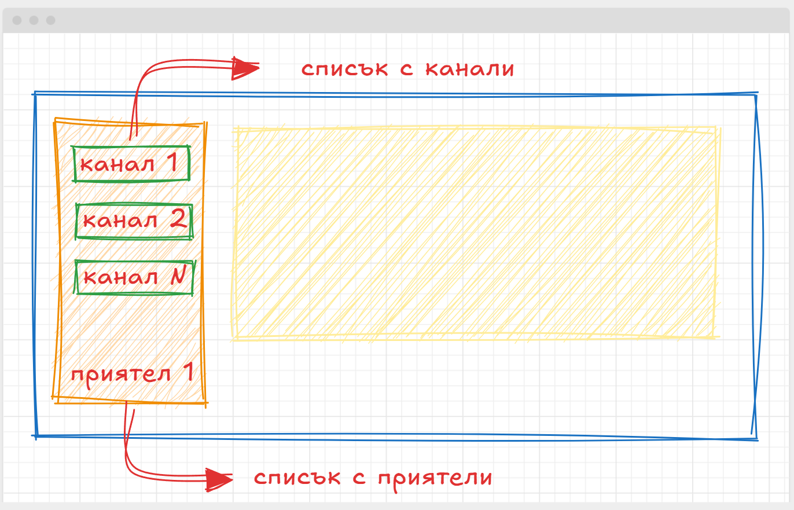
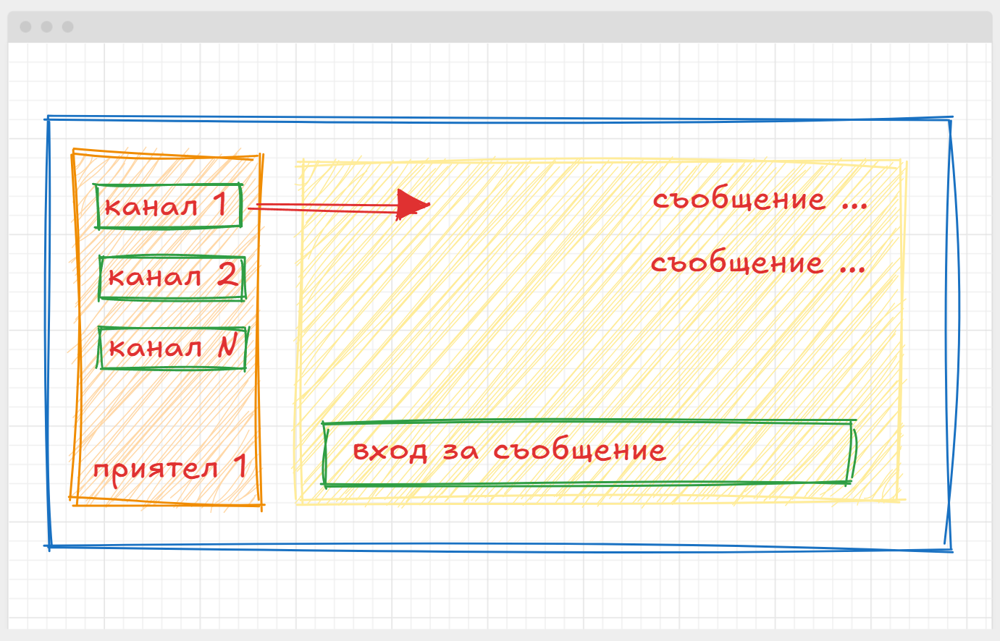

### Курсов проект - ФИНАЛ

**Чатове матове**

### Описание на проекта:
Свеж стартъп иска да разработи система за управление на онлаин комуникация - наподобяваща някой от популярните платфорки като Teams / Discord / Slak и прочие. Бизнеса не предоставя никакви иновации но за сметка на това, може да предложи още от същото с различно име. 

### Бизнес спецификация. 
Компанията е подготвила списък с функционалности, които са типични за такъв тип платформи:
- Създаване на нов потребител;
- Потребителя има възможност да използва канал;
- Потребителя може да добавя, други потребители към канала от списък с потребители;
- Потребителя може да Изпраща съобщения на всеки еди от потребителите;
- Потребителя може да изпраща съобщения към канал, като всички потребители в кана имат възможност да виждат тези съобщения;
- Потребителя може да добавя други потребители към своята приятелска листа.

**Права**
- потребителите създали канал се явяват условно СОБСТВЕНИЦИ на този канал. Те са единствените, които могат да добавят други потребители, да променят името на канала, както и да го изтриват. 
- добавените към канала потребители имат по подразбиране право да пишат в канала
- СОБСТВЕНИКА на канала може да, предостави роля АДМИНИСТРАТОР на всеки един от членовете на канала
- АДМИНИСТРАТОРИТЕ на канала могат да добавят, други потребители в канала, както и да променят името му. 

### UI спецификация

Клиента, оставя до голяма степен на вашето въображение, начина по който ще организирате приложението си. Но за ваше удобство споделяме няколко концептуални скици, които ще ви дадът идея, каква е визията на клиентите. 

Основната визия на проекта е заключена в класическата странична ленка и основно съдържание. 

По идея на главния дизайнер страничната лента ще включва всички канали, в които членува потребителя, както и всички негови текущи приятели. Добре е да се помисли за вариант при който да можем да преминаваме условно на следваща страница, особено ако имаме много записи.

Голямата идея разбирасе е да можем да разгледаме кои какво е написал, всеки път когато кликнем или върху канал или върху името на наш приятел.

### Изисквания към проекта:
- Проектът трябва да бъде разработен с помощта на **Spring Boot** и да използва неговите вградени компоненти за обработка на REST API.
- Използвайте база данни, за съхранение на данните, получени от приложението - като информацията за SQL трябва да е представена под формата на **миграции**.
- Системата трябва да предостави визуална част, като подбора на работна рамка или библиотека, оставяме изцяло на вашето въображение.
- Обработката на грешки трябва да връща смислени съобщения и HTTP статус кодове (напр. 400 Лоша заявка, 404 Не е намерено).
- Изтриването на данните, трябва да се случва **"МЕКО"**
- Предоставете export на postman тестове
- Кода на проекта, трябва да е предаден като линк към GIT система, без значение дали това е GitHub или GitLab

### Формиране на крайната оценка
По време на изпита, студентите ще бъдат приканени да демонстрират валидността на своите разработки, като предоставят набор от **тестове на API** и демонстрация на основните UI функционалности. Оценката ще се формира по точкова система, описана в края на това задание.

### Тестове на API 
За да проверим коректността на API то е необходимо да предоставите POST - ман експорт, съдържащ следните ENDpoint тестове, подредени в папки. Всеки един от тестовете има номерче, за да можете по-лесно да се ориентирате при създаването им:

**Потребител**
- Потребител може да търси сред всички регистрирани в системата потребители
- Потребител може да добави друг потребител
- Потребител може да създаде канал
- Потребител може да изтрие СОБСТВЕНИЯ си канал
- Потребител може да премахне ГОСТ потребител от СОБСТВЕНИЯ си канал
- Потребителя може да види във всеки един момент всички канали в които членува, както и всички приятели, които е добавил

**Потребители**
- Потребител може да изпрати съобщение на свои ПРИЯТЕЛ
- Потребител може да пише в произволен канал, в който членува
- Потребител може да чете кореспонденцията, със свой приятел
- Потребител може да чете кореспонденцията, в произволен канал, в който членува

**Права**
- потребител с роля СОБСТВЕНИК на канал може да изтрива канал 
- потребител с роля СОБСТВЕНИК на канал може да дава роля АДМИН на друг потребител
- потребител с роля ГОСТ на канал НЕ може да изтрива канал 
- потребител с роля ГОСТ на канал НЕ може да променя името на канал 
- потребител с роля АДМИН на канал може да добавя нови потребители

### Демонстрация на UI
UI на приложението трябва да репликира 1:1 функциите заложени в описаните по рано тестове. Не се изисква КРАСОТА, а функционалност.

