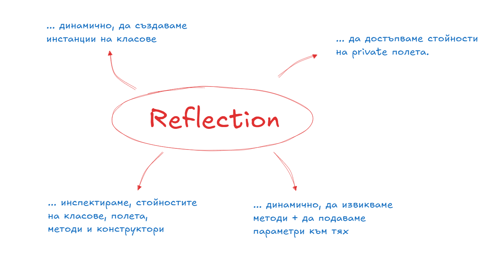
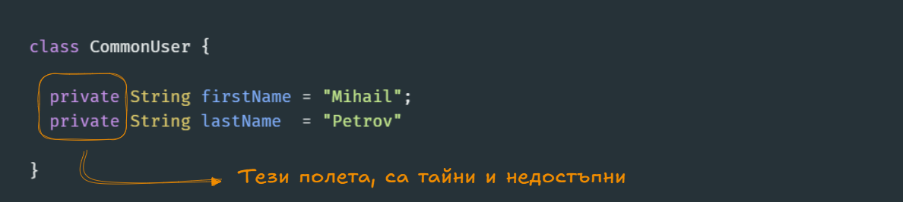

# Какво е Reflection

Езика Java пази мръсна тайна, знанието на която може да ви предостави инструменти, с които да разработвате на пръв поглед магически неща. От заглавието може би вече сте се досетили говорим за въпросния Reflection. Ако трябва да го опишем с думи прости това е набор от функционалности, които ни дават възможност да **инспектираме** кода на нашето приложение, през кода. Та да да дам. 

## Да открехнем вратата

Цялата картинка ще се изясни, когато започнем да работим с примери - но на кратно възможните "инспекции", които можем да правим включват:
- да получим информация за произволен клас, метод, поле или метод
- да достъпваме, инстанцираме и генерираме код динамично

## Да започнем с елементарен пример

Разбрахме че основната идея е да разглеждаме вътрешностите на произволен Java код. Нека да си направим един клас, който ще се превърне в опитното зайче на нашия експеримент.

Класа CommonUser, е решил стабилно да скрие своята информация, зад две на пръв поглед стандартни полета, с модификатор на видимост **private**. Всеки начинаещ Java разработчик, че тези полета няма как да бъдат достъпени, в този си вид и често те си партнират със съответния getter.

Това поведение е напълно логично и съотвества на всички добри практики, но какво да правим ако искаме да напишем програма, която иска да разбере какво е първото и второто име на потребителя, без да е необходимо видимостта на неговите полета да бъде променяна.

Тук на помощ ни идва пакета **java.lang.reflect** , които съдържа всички необходими функционалности за да разкостим всеки клас, метод или поле, което ни се изпречи на пътя. 

