# Среща 6 - Въведение в Angular и концепцията за работни рамки
 
#### 💡 Какво разгледахме днес
- Какво е Angular и има ли почва у нас
- Сравнение на проекта с други популярни приложения на пазара
- Настройка на VSCode и популярните плъгини за него 
- Инсталация на NodeJS
- Инсталация на Angular CLI
- Създаване на първия ни Angular проект с помоща на CLI-a
- Структура на Angular проект и основни понятия[Код](./source/v1)

#### 🔗 Полезни линкове
- [Уроци и първи стъпки](https://angular.dev/)

<!-- #### 🔗 Полезни линкове
- [Уроци и първи стъпки](https://angular.dev/)
- [Компоненти](https://angular.io/guide/component-overview)
- [Сервизи](https://angular.io/guide/architecture-services)
- [Темплеити](https://angular.io/guide/template-overview) -->

<!-- #### 🕹️ Ресурси и материали
- [Сорс код от срещата](./source/) -->

### Какво е Angular и има ли почва у нас ? 
Angular е работна рамка, за създаване на съвременни SPA приложения. В това изречения има поне две неизвестни на които трябва да намерим отговор:
- Какво е работна рамка ?
- Какво е това SPA приложение ?

Разбира се че обожаваме, определенията ни да съдържат още повече определения, но няма как тази материя е далеч от елементарна. 

#### Какво е работна рамка ?
Когато се опитваме да решаваме даден програмен проблем, често ни се налага да прибягваме до решенията на други по знаещи и по опитни програмисти. Обикновенно ползваме същите под формата на външен код, които или е вграден в езика за програмиране, които ползваме или трябва да си го вземем от вън. Така например в езиците за програмиране, които ползваме рядко ни се налага да имплементираме методи за сортиране или механизми за изпращане на съобщения - често ги ползваме на готово. 
Обикновенно когато решаваме някакъв проблем с външен код, то казваме че ползваме библиотека или колекция от функции, които решават проблем Х. 
- Библиотека за сортиране;
- Библиотека за математически операции;
- Библиотека за визуализация на данни;
- Библиотека за криптиране на информация.
Или иначе казано строго насочен набор от функционалности, които решава клас от проблеми или един конкретен проблем. 

До тук обяснявахме библиотека, което нямаше нищо общо с първоначалния въпрос. Е не съвсем. Работна рамка е колекция от свързани библиотеки, които решават задачи свързани с моделирането на някакви процеси (workflow). Работните рамки често дефинират - набори от стъпки през които трябва да премине програмата за да реши даден проблем. В този ред на мисли Angular ни дава набор от абстракции / библиотеки с които:
- да създаваме компоненти, чрез които да визуализираме данни и HTML страници
- механизъм за управление на тези страници
- система за взимане и изпращане на данни към сървъри
- цялостен механизъм за управление на сигурност и достъп до ресурси
- и още много други.
Комбинацията от всички тези възможности ни позволява да направим архитектурно консистентно приложение, с типичен и предвидим процес.

#### Какво е SPA (Single Page Application) ? 
Single Page Application накратно SPA е архитектурен модел за организиране на съвременни WEB приложения, които е базиран върху идеята че страницата не бива да се презарежда, като по този начин се предоставя много гладки и маааааааазно потребителско изживяване. 

Класическия начин по който се правеха WEB приложения преди години се свеждаше до следните стъпки:
* потребителя прави заявка от своя браузър към WEB сървъра
* WEB сървъра подготвя HTML / CSS и JavaScript резултата и го изпраща към браузъра
* Браузъра визуализира получената от сървъра информация
За да може да се случи това е необходимо всеки път да се презарежда новото съдържание. Този подход е известен като MPA (Multy Page Application) - като основната роля в този контекст играеше исторически WEB сървъра

SPA логиката е малко по различна. Когато потребителя зареди за пръв път страницата, той получава един единствен index.html файл с мнооооооооооооооооого обемен JavaScript код, който съдържа в себе си всички възможни страници на приложението. 
Когато потребителя направи заявка, приложението изпраща сигнал до сървъра за получаване на данни под формата на JSON или друг формат, като тези данни се предават на HTML темплейта и се наливат в него. 
По този начин приложението не трябва да се презарежда, което гарантира възможността то да предостави много визуално богато изживяване на крайния потребител. 

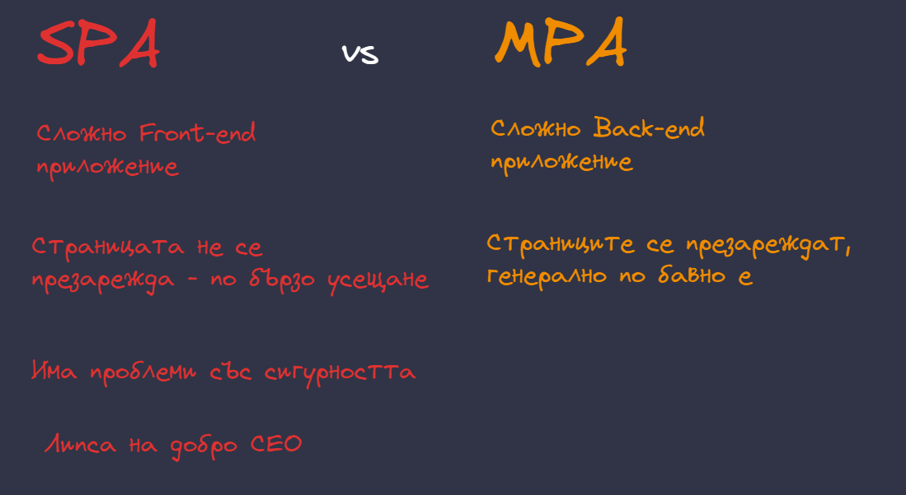

След като имаме контекста в главата си е време да сложим на масата и самия Angular. Това е един от многото продукти, които ни улесняват докато работим по изграждането на сложно SPA Front-end приложение, докато ни държи в рамките на някакъв предварително дефиниран процес, за да правим възможно най-малко грешки. 

#### Защо да не ползваме чист JavaScript ?

Ако сте по любопитни или сте се занимавали и преди години с JavaScript можете да се запитате защо ни е тази рамка и как ни помага. Основния отговор е именно абстракция и решаване на нетривиални проблеми при работа с JavaScript. Имаме няколко много добре документирани проблема, които чистия JavaScript няма как да реши:
- несъвместимост между браузърите. Всеки браузър си има собствена имплементация на JavaScript, за добро или за лошо може да попаднем в ситуация в която Chrome е по напред от Firefox, което означава че дадена функционалност не е имплементирана, както трябва.
- вербозен код за работа с DOM дървото. Браузърите предоставят имплементация на така нареченото DOM дърво - това е HTML кода който пишем представен като JavaScript обекти, с които ние можем да си играем. Е ца съжаление API то е доста тежко за работа и само след няколко десетки реда код, можем да попаднем в ситуация на пълен колапс. Рамките и библиотеките, основно се занимават с елиминирането на този проблем.
- Консистентност на работа. Както вече се разбрахме рамките ни дават ограничение, да сведем спагети кода до минимум.

### Как да се ориентираме във версиите на Angular

Angular не е нов продукт, което означава че доста информация е вече изписана за него и е напълно адекватно да си зададем въпроса - как да навигираме между отделните верси на проекта и как да сме винаги актуални. 

В момента на пазара съществуват две версии на проекта:
- AngularJS - това е оригиналната версия на проекта от 2010 година. Беше нещо много яко тогава, изигра важна роля в развитието на технологиите, нооо отдавна изпя своята песен. Проекта е офицялно архивиран, но в интернет просранството циркулират доста уроци за AngularJS (избягвайте ги)
- Angular - напълно обновена морално, семантично и синтактично версия на проекта. Условно беше наречена Angular 2.0 преди години но това име се избягва. Това е проекта който разглеждаме и използваме.

Angular се разработва активно, като нова версия излиза на всеки 6 месеца. Обикновенно екипа се опитва да бъде винаги cool и си позволяват активно да ядосват обществото около проекта, но след време се свиква. От версия 17 проекта има ново лого и заявка за така наречения ренесан, така че очакваите изненади. 

> ВАЖНО
> 
> Не ползвайте AngularJS освен ако нямате опрян пистолет в главата

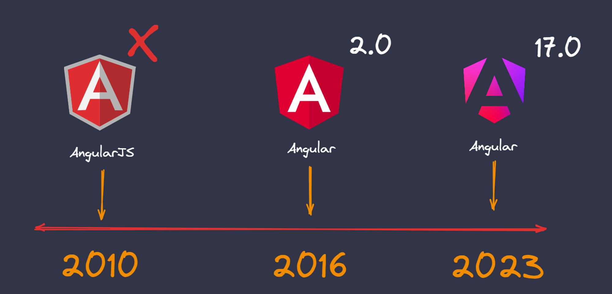

### Сравнение на проекта с други популярни приложения на пазара

Един напълно адекватен въпрос, които можете да си засдадете е защо пък да ползвам ANgular като има толкова много други алтернативи. Това не е реклама на прах за пране в сравнение с другите подобни препарати, но ще използвам да ви кажа някои от уникалните характеристики на този проект в сравнение с най-популярната към момента библиотека ReactJS.
- Angular e работна рамка, която държи изключително много на своите си предварително дефинирани архитектурни принципи и функционалности. Рядко се дава свобода за импровизации, така че стриктно ще следваме инструкциите на екипа. Това ни гарантира изключително консистентен код.
- Angular ползва TypeScript като задължителна абстракция - доста подходящ инструмент за големи проекти, но пълен кошмар що се отнася до ученето на нови езици. Е винаги можем да изключим проверките и да си пишем TypeScript като стандартен JavaScript, така че няма драма.

От друга страна ReactJs ни дава свобода:
- това е UI библиотека, тоест нямаме никакви ограничения за това какво да ползваме при организирането на потребителското изживяване
- Тази свобода за съжаление често може да доведе до спагети, особено сред потребители, които нямат опит в проекта
- ReactJS няма задължителна абстракция освен така наречения JSX, който се занимава с HTML и обективно погледнато е доста елементарен, за да представлява някаква заплаха за интелектуалния ни потенциал. 

Има ли верен отговор ? Ами по скоро не. 
- Angular е супер добър избор за сложни и тежки поректи, защото предоставя структура и доста от решенията вече са взети вместо нас.
- Мога да кажа същото за ReactJS само че в доста по идиалистична светлина.

В края на деня е въпрос на личен избор, така че индоктринацията свършва до тук 😄.

### Инсталация на необходимия софтуер

Преди да започнем да гледаме критично и да се чешем по главата в опит да разработим приложението на мечтите си - е необходимо първо да си организираме локална среда за разработка. За целта са ни необходими няколко важни инструмента.

#### Инсталация на NodeJS 
Angular както и почти всички (да си кажем направо всички), съвременни работни рамки и библиотеки не могат просто ей така да се пуснат в браузъра ни. Те доста често имат нещо специално в тях - друг език за програмиране като TypeScript или абскракция на HTML като JSX или някаква междинна стъпка за генериране на малко по различен код. С думи прости - сложно е. Затова ни е необходим инструмент, който да вземе нашия код и да му приложи необходимите трасформации. В този случай това е NodeJS среда за изпълнение на JavaScript код, която се инсталира на нашата операционна система. 

Трябва първо да си свалим инструмента от офицялния сайт на [NodeJS](https://nodejs.org/)

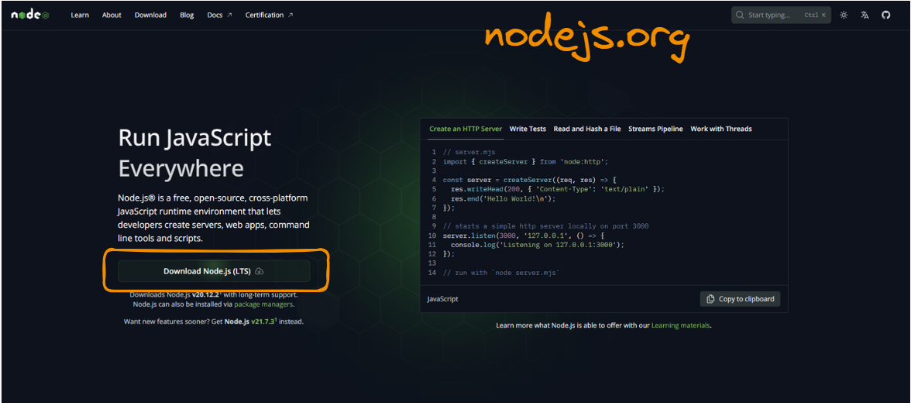

Инсталацията е типична за подобен тип инструменти просто следваме Next / Next / Next процеса и профилактично рестартираме (особено ако сме под Windows), след като приключим с инсталацията.

Ако всичко е преминало успешно (и рестарта разбира се), можем да проверим дали NodeJS е инсталиран успешно като отворим конзолата и напишем командата **node -v**. Би трябвало да получим информация за актуалната версия на NodeJs върху нашата машина. Ако вашата версия е различна от моята, не се притеснявайте - просто е важно да няма фатална грешка или нещо подсказващо че положението не е на добре.

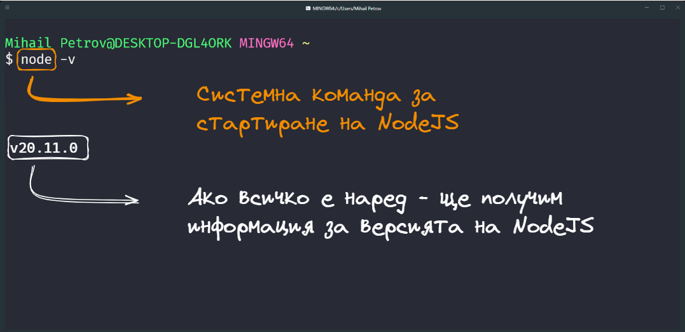

#### Инсталация на Angular CLI (генератор на Angular проекти)

Може би си мислите, че за да започнем да работим с ANgular ни е необходимо да си свалим кода на проекта от офицялния сайт и може би да го добавим по някакъв начин към **index.html** на новото ни приложение. На тази мисъл ще въздъхна и ще си спомня за славното минало в което нещата бяха толкова прости. Но уви Angular е сложен проект, които разчита на множество библиотеки, чиято функционалност доста често е мистерия за нас, пък и няма нужда да го мислим на толкова ранен етап от нашето развитие. 

За тази цел ще си инсталираме офицялния гененратор на Angular проекти, които ще се погрижи не само да ни създаде нов проект, но също така и да ни намери и свали всички необходими библиотеки.

Как да си инсталираме тогава този мистериозен генератор? Можем да го намерим в [NPM](npmjs.com) - още една нова думичка 😄. Заедно с инсталацията на NodeJS към нашата операционна система се добавя и допълнителен пакет, от функционалности за работа с така наречения NPM (Node Package Manager) - това е виртуална мрежа която организира огромно количество предварително разписани JavaScript пакети, които можем да свалим от интернет пространството. Ако имате опит с други езици за програмиране то можете да си представите че това е нещо като:
- Maven за Java
- Composer за PHP
- PIP за Python
- NuGet за .NET

Така че на първо време можем да посетим сайта на [NPM](npmjs.com) и в полето за търсене да напишем Angular CLI - названието на Angular генератора, който ще ползваме. Няма никаква гаранция в какъв ред ще се визуализират пакетите - така че търсим проект с название **@angular/cli** и смело кликаме върху [ЛИНКА](https://www.npmjs.com/package/@angular/cli)

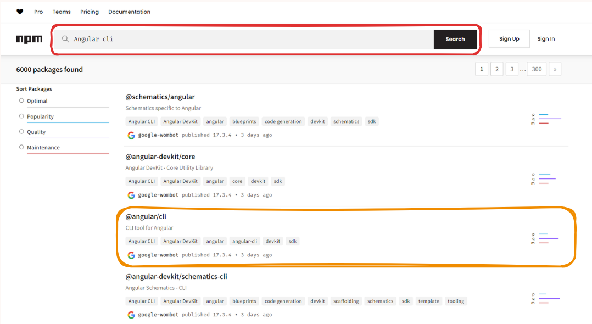

След като основната страница на пакета демонстрира своя блясък, насочете погледа си към десния страничен панел където се намира командата за инсталация на същия - която ни примамва да я копираме.

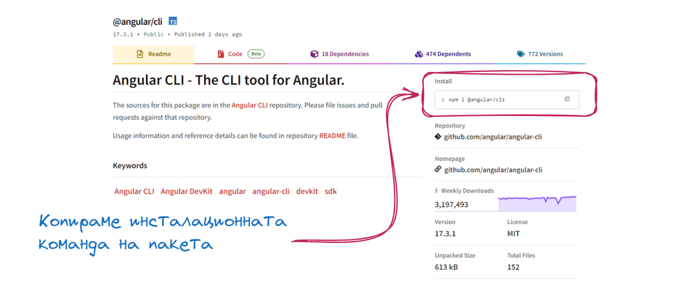

Отново се връщаме в конзолата за пореден път и поставяме командата в нея. Не бързайте обаче да я изпълнявате, защото ще добавим и нещо допълнително към нея. 

Ако изпълним командата **npm -i @angular/cli** ще инсталираме пакета локално, което е ок в огромен процент от случаите. Обаче - в момента - искаме да се сдобием с генератор на проекти - което обикновенно означава че искаме да го използваме от всяка точка на нашата операционна система. Поради тази причина ще инсталираме пакета **ГЛОБАЛНО**, като добавим **-g** след командата.

> npm i -g @angular/cli

Сега вече може спокойно да натиснем Enter и да инсталираме пакета глобално.

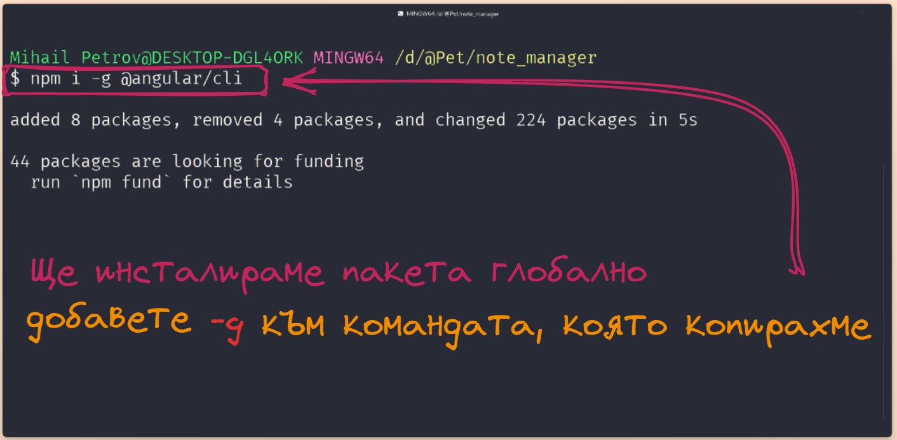

### Работа с Angular CLI 

Генератора който инсталирахме съдържа в себе си няколко доста полезни функционалности:
- можем да генерираме цялостен Angular проект от нулата;
- можем да генерираме отделни парченца от Angular приложението - като компоненти, сервизи, директиви и тн;
- можем да стартираме приложението си и да го актуализираме в реално време.

Понеже инсталирахме Angular CLI глобално - вече имаме достъп до специална команда наречена **NG**, която може би се досещате  - можем да ползваме чрез нашата конзола. За да създадем нов проект ползваме под командата **new** и добавяме името на проекта / името на папката, в която ще се позиционира същия. 

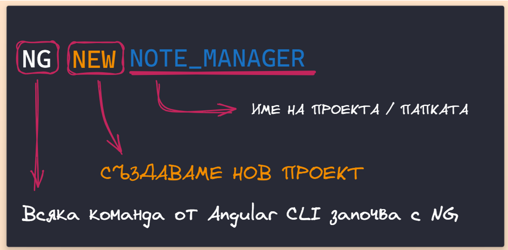

Чисто експериментално ще направим един примерен проект **note_manager**, като цялата команда изглежда по следния начин 
> ng new note_manager

След като стартираме командата - ще ни се даде възможност да изберем няколко допълнителни опции за конфигуриране на ANgular проекта. В зависимост от версията на генератора тези опции могат да варират, но без значение коя изберем, можем на по-късен етап напълно да променим избора си. Затова ви съветвам да не обръщате толкова голямо внимание на предложенията, а просто да изберете смело опциите по подразбиране и да приключите с генерирането по бързо. 

След като приключим с тази процедура, генератора започва да сваля необходимите библиотеки от различни хранилища в интернет пространството. За около 3 - 5 минути всичко ще е приклюбило и можем да се гмуркаме в кода.

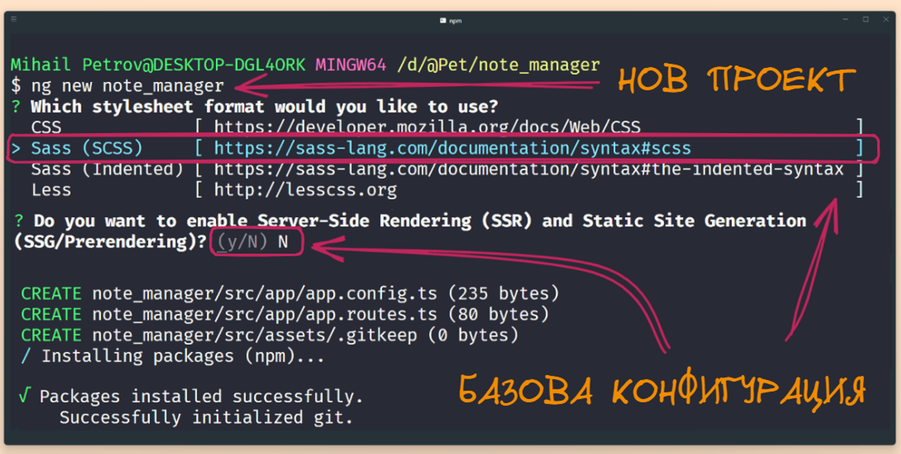

### Какво ни генерира Angular CLI ?

Отворете папката note_manager (**или както сте решили да я кръстите**) и нека заедно хвърлим едно око на файловата структура. Виждаме че генератора се е постарал да ни напълни с папки и файлове, но какво означават те.

#### Системни файлове

#### Angular специфични файлове

За щастие по голямата част от проекта е запазена за Angular специфичните файлове и папки - да им хвърлим едно око, започнайки отгоре на доло:
- папката **app** - тук ще създаваме всички функционалности, които са свързани с приложението, което ще създадем. Това включва TypeScript класове, CSS файлове и почти целия HTML, които ни трябва за визуализация. Почти 100% от времето ни ще прекарваме тук.
- папката **assets** - всичко което не е код, но трябва да участва в приложението ще бъде командировано тук. Това включва картинки, иконки, шрифтове, документи които искаме да закачим към приложението. Angular има предварителна конфигурация, за зареждане на всякакви ресурси от asset папката което прави разделението между приложен код и ресурси мноооого ясна и лесна. 
- файла **index.html** - без много много да го увъртаме това е основния HTML документ от който стартира нашето приложение. Няма да ни се налага да го докосваме в нито един момент. 
- файла **main.ts** - това е като index.html само че за Angular проекта - тук обикновенно се конфигурират подробностите свързани със зареждането на специфични за приложението функционалности. Още в рамките на това упаражнение, ще си поиграем с този файл.
- файла **styles.scss** - съдържа глобални стилове, които се ползват от цялото ни приложение
- файла **angular.json** - това е специален конфигурационен файл който информира Angular компилатора, за детаили свързани с генерирането на резултатния код. Всеки път когато стартираме едно Angular приложение, компилатора трансформира целия код който сте написали в по удобна за изпълнение крайна структура, която пък от своя страна е напълно нечетима за нас като програмисти. В рамките на този файл се описват всякакви особености на това как да се генерира крайния код. На този етап, конфигурация от този тип е твърде сложна за нас, за това просто ще се задоволим с мистериозния характер на файла и ще трупаме знания за да се изправим пред него в бъдеще.

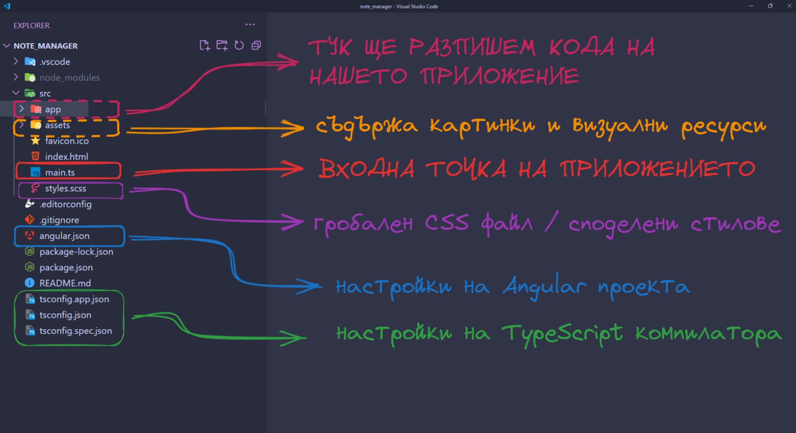

### Хайде да стартираме проекта

Толкова много приказви, а още дори не сме видели какво представлява този новогенериран Hello World проект, който с толкова много любов и мъки доставихме до нашите компютри. Допускам че няма да се изненадате като ви кажа че за да стартираме проекта ще ползваме командата **ng**, с която генерирахме същия. 

Като за начало е необходимо да се намираме точно в папката в която е позициониран кода на нашия проект. Изпълняваме командата **ng serve** и се облягаме удобно на столчетата си. 
Командата върши няколко операции в една:
- първо компилира кода, който сме разписали до момента и генерира изходен код който е удобен за пускане в браузъра. Тоест създава JavaScript файлове от TypeScript файловете. 
- второ оптимизира кода - ако имаме излишни парчета код, които не са необходими за да функционира приложението, то те ще бъдат изтрити или кеширани така че системата да се държи доста по пъргаво.
- трето стартира приложението - това е долго очаквания момент. Системата избира порт на който да стартира нашия Angular проект, като по подразбиране той е **4200**. Ще забележите съобщение, което ви подсказва че проекта може да бъде достъпен на адрес **http://localhost:4200**

> ВАЖНО Е ДА ЗНАЕМ
> Когато стартираме приложението си с **ng serve** системата автоматично следи за промени в кода и генерира нов код динамично, без да е необходимо да спираме и пускаме сървъра всеки път когато направим нова промяна. Допълнително ще забележите че браузъра се актуализира всеки път когато си съхраните промените - което е епично.

Сега отворете любимия си браузър и въведете **http://localhost:4200** в адресната лента. Алтернативно можете да кликнете върху адреса, който ви се появява в конзолата, ако операционната ви система го позволява. Приложението което се генерира по подразбиране е стандартна информационна страница, с полезни линкове, които ви съветвам да разцъкате от любопитство. 

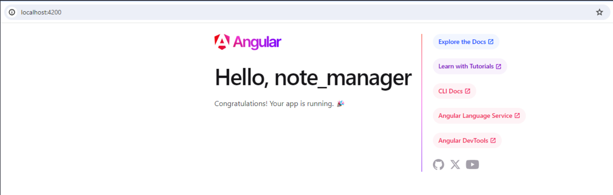

До тук приключваме с любезностите, време е да пишем код. 

### Да си поизцапаме ръчичките

Кода който любезния генератор достави за нас е малко по сложен от колкото ми се иска. Педагогическия ми порив силно желае да опрости нещата затова **смело** отворете проекта и изтриите файловете:
- app.component.spec.ts
- app.config.ts
- app.routes.ts

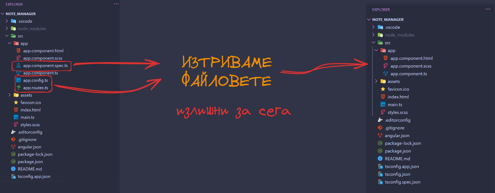

Ако проекта ви е бил пуснат, очаквайте системата да изреве на умряло и да получите грешки в конзолата. Ако не е бил пуснат, то няма да можете да го стартирате преди да оправим грешките.

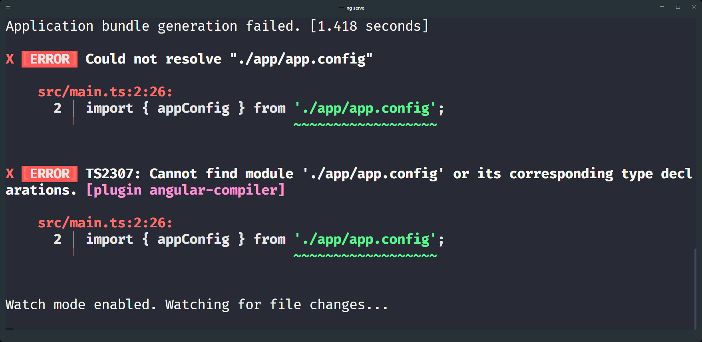

#### Да оправим грешките, които сътворихме

Виждаме от грешката в конзолата, че не можем да открием файла app.config което е напълно нормално защото вече го изтрихме. Единственото място в което този файл се ползва към момента е **main.ts**.

Можем да го разгледаме и ще установим че:
- на първо време зареждаме файла appConfig 
- след това го ползваме в **bootstrapApplication**

Без никаква милост изтриваме излишния код.

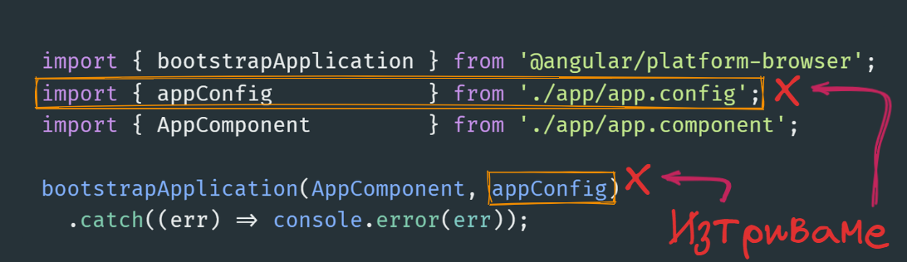

Крайния резултат е функцията **bootstrapApplication**, която има за цел да стартира нашия основен компонент в този случай **AppComponent**. На този етап няма да ни се налага да правим никакви корекции и да го оставим да си работи. 

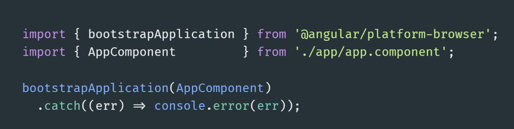

Грешките в конзолата ще се изчистят и можем спокойно да пристъпим към промяна на кода. 

### Първият ни компонент

Основния градивен елемент на всяко едно Angular приложение, се нарича компонент. Тои представлява комбинация от:
- JavaScript / TypeScript код
- HTML темплейт
- CSS стилове
Можете да възприемем компонентите като **HTML елемент**, които можете да ползвате на произволно място във вашето приложение или като **страница**, в която да съхранявате други Angular компоненти. 

Искам да прегледаме компонента **app.component.ts**, които Angular CLI създаде за нас, защото той съдържа парченца, които ще ползваме в ежедневната си практика. 

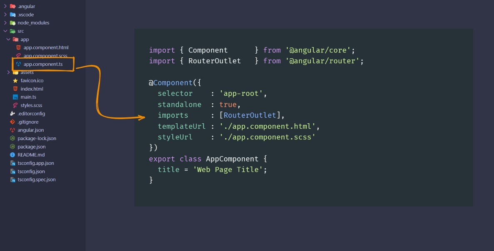

Без паника компонентите са просто един най-обикновен TypeScript клас, който съдържа логиката за:
- визуализация на HTML елементи;
- работа със събития;
- калкулиране и трансформация на данни.

За да кажем на Angular, че класа е по специален, трябва да използваме специфичен TypeScript синтаксис наречен декоратор. Всеки декоратор започва със съмвола **@**. Angular ни предоставя и други декоратори, като имената им веднага ще ви ориентират, за какво става дума например:
- @Component - казва на Angular че класа е компонент и може да работи с HTML темплейки
- @Directive - казва на Angular че класа е директива и може да променя HTML елементи
- @Injectable - казва на Angular че класа съдържа логика, която можем да ползваме / инжектираме в компоненти

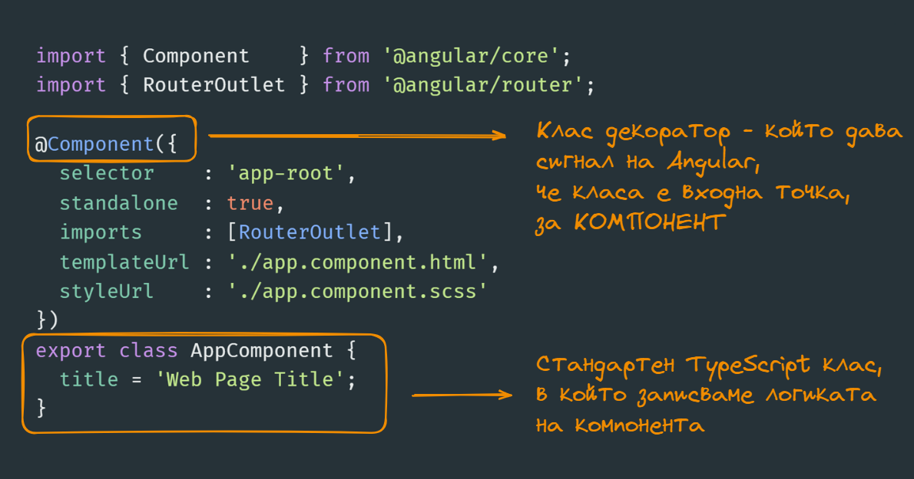

Всеки един декоратор, съдържа специфични свойства, които ще разжлеждаме в детайли. Сега ще обърнем внимание на някой от най-важните без, които няма как да да създадем валиден компонент.

#### Селектор
Angular силно промотира декларативното програмиране, тоест опитваме се да прекарваме максимално много време в HTML темплейта в опит да си свършим работата:
- пишем HTML елементи
- въртим цикли
- създаваме условни конструкции
- извикваме други Angular компоненти

За да можем да можем да разопаковаме един компонент и да го накараме да работи е необходимо да му зададем име. Това име се задава чрез свойството **selector**. 

Ако проследим как се извиква генерирания AppComponent ще видим всъщност че селектора му **app-root** се използва в рамките на **index.html** файла, заедно с офицялните HTML елементи, които ние познаваме. 

> 💡 **ДОБРИ ПРАКТИКИ**
> 
> Когато избирате название за вашия селетор, се опитайте да се придължате към следните идеи. 
> - Не включвайте думичката component в името на селектора, това е доста излишно
> - Опитайте се да вкарате достатъчно семантично значие. Какво ще прави този компонент. Може да е календар, бутон или някаква друга UI компонента
> - Добра идея е да ползваме префикси. По подразбиране Angualar ползва **app**, но вие можете да си създадете свои като например **page** или **sidebar** или **modal**

Задължително е всеки път, когато ползвате селектора на компонента, да го дефинирате с отварящ и затварящ таг, за да не се обърка системата. 

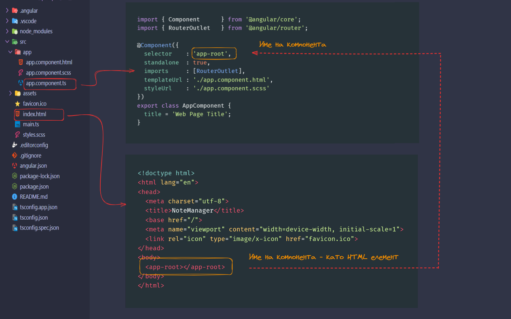

#### Линкове към външни файлове
Всеки един компонент може да дефинира в себе си линкове към външни ресурси:
- templateURL - задължително свойсто, което указва пътя към HTML темплейта. Няма как да имаме компонент без кореспондираща HTML структура. Пътя обикновенно се задава като релативен спрямо, TypeScript класа.
- styleUrl - незадължително стойвсто, което указва пътя към CSS / SCSS файла, със стиловете за този конкретен компонент. 
- styleUrls - това е версия на горното свойство, което може да укаже масив от CSS файлове, особено ако искаме да добавим външни такива за този конкретен компонент.

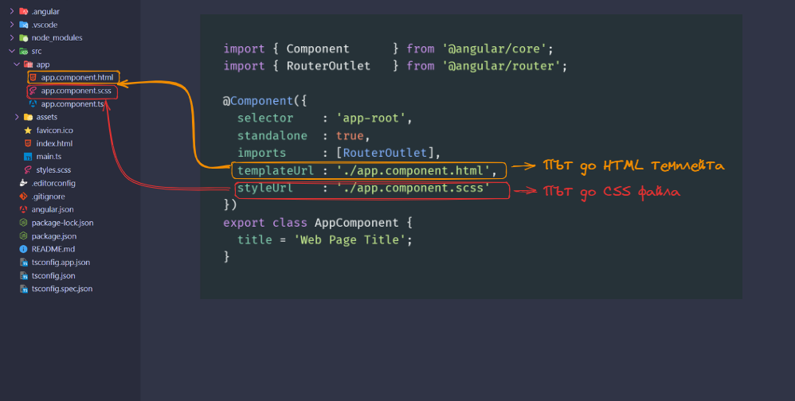

#### Комуникация между TypeScript и HTML 
Една от силните страни на Angular е че ни дава възможност без много много главоболия, да направим връзка между програманата логика и HTML темплейта, само с помоща на вградените в рамката инструменти.
Едно от най-елементарните връзки е тази между полетата в TypeScript класа и тяхната употреба в HTML темплета. 

Да разгледаме следния пример
Дефинираме поле **title** което има произволна стойност. Това поле може да съдържа:
- текстова информация
- някаква числова стойност
- масив от данни

Стойността на полето може да бъде директно визуализирано само с помоща на специален синтакстит **{{** ПОЛЕ / КЛАС ПРОМЕНЛИВА **}}** - известен като **интерполатор**. По този начин можем да покажем абсолютно всичко в рамките на компонента. 

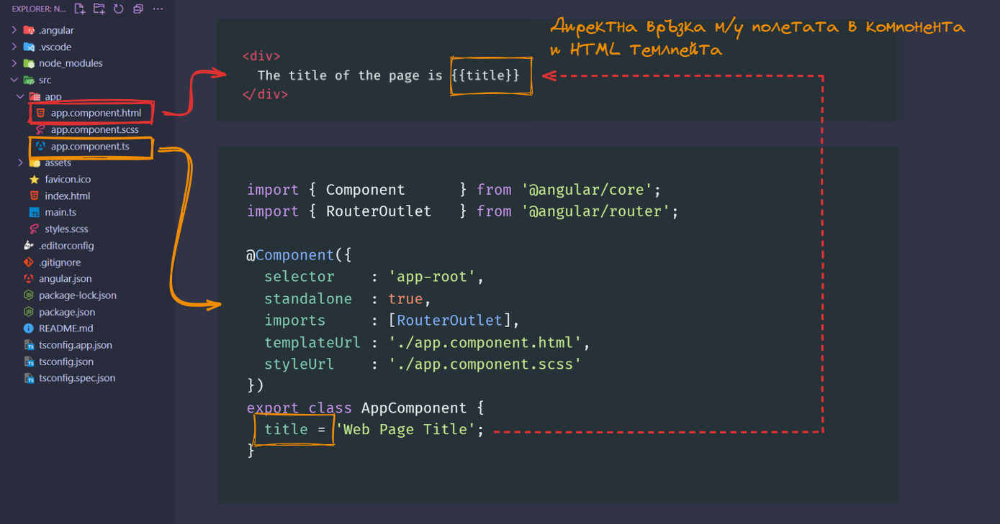

### Как да работим с документацията на Angular от къде да търсим помощ ?
За добро или лошо Angular е доста солиден инструмент за разработка на приложения, което неизбежно ще ни постави в ситуация, да търсим отговор на въпроса как да решим този и този проблем. За тази цел ни е необходимо да разчитаме на някакъв информационен ресурс или документация. Нека да видим какви възможности имаме. 

#### Основна документация на проекта

Най-важния информационен ресурс е офицялната документация на Angular. Към момента тя е разпределена между два сайта:
- [angular.io](https://angular.io)
- [angular.dev](https://angular.dev)

Лично аз предпочитам втория сайт, защото той е обновена версия на основната документация и съдържа в себе си доста по структурирани, организирани и най-вече актуални ресурси не само за това как се работи с отделните абстракции на рамката, но и доста подходящи уроци, които можете да разцъкате директво в сайта, на проекта. 

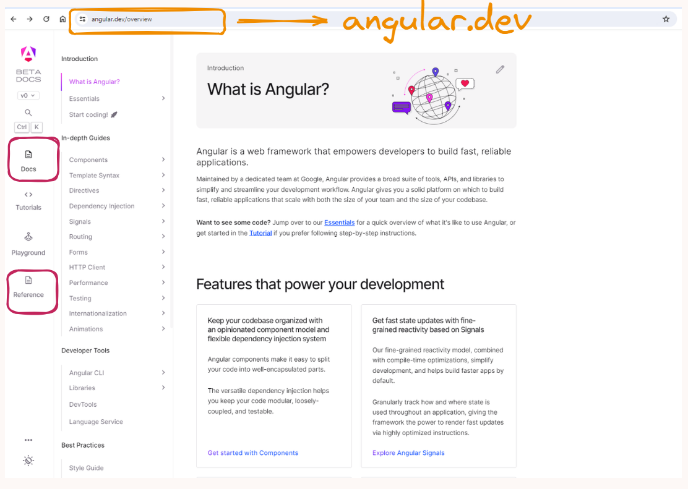

#### Видеа и уроци
Някой много интересни и задълбочени уроци можете да намерите в следните канали в YouTube:
- [Decoded Frontend](https://www.youtube.com/@DecodedFrontend)
- [Monsterlessons Academy](https://www.youtube.com/@MonsterlessonsAcademy)
- [Angular University](https://www.youtube.com/@AngularUniversity)

Винаги можете да разчитате на [StackOverflow](https:://stackoverflow.com) ако ситуацията съвсем излезе извън контрол.
