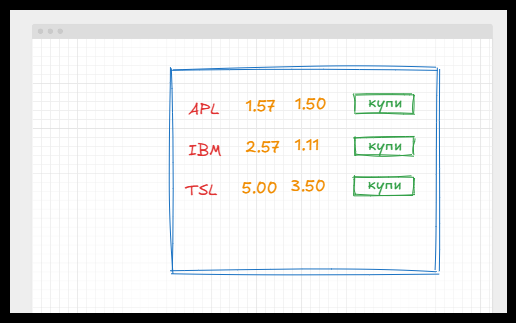
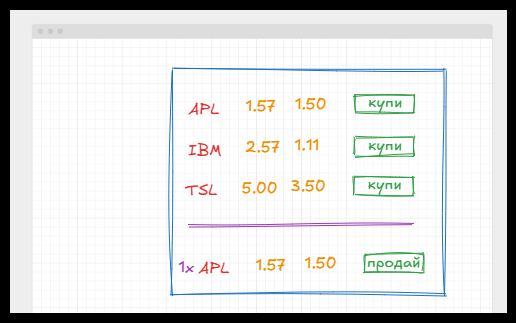
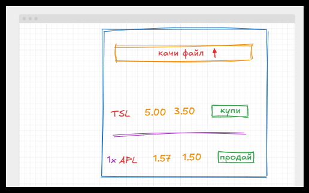

# Уолстриит тигър

На борсата винаги е трудно,  особено за простосмъртните. Цифри и числа летят на горе и на доло в опит да направят пачка. Как да се ориентираме ? - разбирасе като си помогнем програмно. 

Малка компания за разработка на инвестиционни инструменти е разработила план, за привеждане в експлоатация на приложение за следене на борсови индекси, акции и валути. Плана за изжраждането на приложението включва няколко стъпки, разписани в бизнес логиката на приложението. 

На този етап от развитието на системата, системата е в ЕДНО ПОТРЕБИТЕЛСКИ РЕЖИМ. 

## Бизнес логика - етап 1

Приложението ни предоставя списък с всички компании / акции, които следим към момента.

Всяка една компания е представена със следните основни характеристики:
- Име (абривиатура от три букви)
- Цена на покупка
- Цена на продажба

Във всеки един момент потребителя може да купи една бройка акция от дадена компания, като тя се отразява в индивидуалното му портфолио и той може респективно да я продаде. 

Потребителя може да характеризира всяка една от компаниите като любима и да я визуализира по по специфичен начин.

## Бизнес логика - етап 2

Потребителя на приложението може да качи Excel / CSV файл, съдържащ информация за всички компании. Системата трябва да валидира и прихваща всички потенциални грешки, които възникват при работа с данните.

